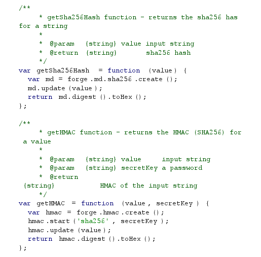
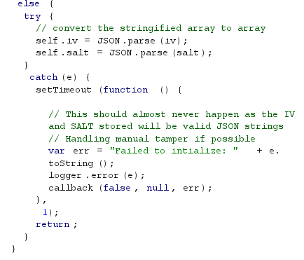
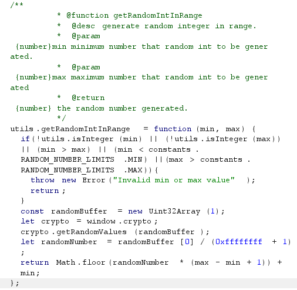

## Dynamic Analysis

```javascript
function KeyForPassword(password, salt) {
  var iterations = arguments.length > 2 && arguments[2] !== undefined ? arguments[2] : DEFAULT_ITERATIONS;
  var key = crypto_js_1.default.PBKDF2(crypto_js_1.default.lib.WordArray.create(password), crypto_js_1.default.lib.WordArray.create(salt), {
    keySize: exports.KEY_SIZE,
    iterations: iterations
  });
  return helpers_1.wordsArrayToUint8Array(key);
}
```

the key object is 

```
{
    "$super": {
        "$super": {}
    },
    "words": [
        1676255787,
        -146408352,
        1697268847,
        -1256175761,
        310502563,
        1722946188,
        1073996908,
        2045595539,
        1680086410,
        1436710343
    ],
    "sigBytes": 32
}
```

and another function

```javascript
var BaseDecryptor = /*#__PURE__*/function () {
  function BaseDecryptor() {
    _classCallCheck(this, BaseDecryptor);
  }

  _createClass(BaseDecryptor, [{
    key: "decrypt",
    value: function decrypt(data) {
      var components = Components_1.default.parse(data);

      var _this$getKeys = this.getKeys(components),
          encryptionKey = _this$getKeys.encryptionKey,
          hmacKey = _this$getKeys.hmacKey;

      var message = helpers_1.mergeTypedArrays([components.getHeader(), components.cipher]);
      var messageWords = crypto_js_1.default.lib.WordArray.create(message);
      var hmacKeyWords = crypto_js_1.default.lib.WordArray.create(hmacKey);
      var hmac = crypto_js_1.default.HmacSHA256(messageWords, hmacKeyWords);
      var hmacArray = helpers_1.wordsArrayToUint8Array(hmac);

      if (!helpers_1.compareArrays(hmacArray, components.hmac)) {
        throw new Error_1.default(Error_1.ErrorType.BadPassword);
      }

      var cipher = crypto_js_1.default.lib.WordArray.create(components.cipher).toString(crypto_js_1.default.enc.Base64);
      var ivWords = crypto_js_1.default.lib.WordArray.create(components.iv);
      var encryptionKeyWords = crypto_js_1.default.lib.WordArray.create(encryptionKey);
      var plain = crypto_js_1.default.AES.decrypt(cipher, encryptionKeyWords, {
        iv: ivWords,
        mode: crypto_js_1.default.mode.CBC
      });
      return helpers_1.wordsArrayToUint8Array(plain);
    }
  }]);

  return BaseDecryptor;
}();
```

and we find the core function

```javascript
function decrypt(message, password) {
  var pass = password;

  if (typeof pass === 'string') {
    var encoder = new TextEncoder();
    pass = encoder.encode(pass);
  }

  var decryptor = Decryptor.fromPassword(pass);
  return decryptor.decrypt(message);
}
```

```javascript
function decryptFileKey(password, encKey) {
  var encryptedKey = (0, _helpers.wordsArrayToUint8Array)(_cryptoJs.default.enc.Base64.parse(encKey));
  var key = RNCryptor.decrypt(encryptedKey, password); // currently the key is encrypted as a utf-8 byte representation of a hex string

  return _buffer.Buffer.from(key).toString('utf-8');
}
```

and the core function for authentication

```javascript
export const checkMasterPassword = (
  // eslint-disable-next-line max-statements, complexity
  ({ password, mountTimestamp, attempts = 0 }: CheckMasterPassword): ThunkAction<void> => async (
    dispatch,
    getState,
    { licenseService },
  ) => {
    const cmpLog = log.extend('checkMasterPassword');

    if (!password) {
      const errorCode = getMasterPasswordErrorCode('provide', password);
      dispatch(trackMasterPasswordFailed('provide', errorCode));
      throw getErrorDescription(errorCode);
    }

    const { oe, user, dashboard: { isUnregisteredMode } } = getState();

    let { authToken } = user;

    let userData: Awaited<ReturnType<typeof licenseService.getUserData>>['user'];

    try {
      await dispatch(verifyExtensionVersion());

      if (!authToken) {
        cmpLog('fetching auth data');
        const result = await licenseService.getAuthData(oe.token, oe.email);
        userData = result.user;
        authToken = result.auth_token;
      } else {
        cmpLog('fetching user data');
        userData = (await licenseService.getUserData(authToken, oe.token)).user;
      }
    } catch (e) {
      try {
        if (mapErrorCode(e) === responseCodes.license.UNAUTHORIZED) {
          cmpLog('refreshing auth data');
          const result = await licenseService.getAuthData(oe.token, oe.email);
          userData = result.user;
          authToken = result.auth_token;
        } else {
          log(e);
          dispatch(trackMasterPasswordFailed('provide', e));
          throw getError(e);
        }
      } catch (e2) {
        log(e);
        dispatch(trackMasterPasswordFailed('provide', e));
        throw getError(e);
      }
    }

    const encKey = userData.key;
    const verKey = userData.verify_key;
    const encKey2 = userData.key2;
    const encDistinctId = userData.distinct_id;
    dispatch(setUserData(userData));

    try {
      cmpLog('validating master password');
      const key = validateMasterPassword(licenseService, password, encKey, verKey, authToken!);
      cmpLog('master password valid');

      let key2 = null;
      if (encKey2 && encKey2.length) {
        key2 = crypto.decryptFileKey(password, encKey2);
      }

      if (key) {
        let distinctId;
        let shouldMigrateVault = shouldMigrateVaultSelector(getState());
        let shouldConnectToVault = shouldConnectToVaultSelector(getState());
        const migrationError = getMigrationError(getState());
        const currentStatus = getMigrationStatus(getState());

        dispatch(setLoadingOverlay('dashboard.accounts.loading', null));

        if (isInProgressStatus(currentStatus?.status ?? null)) {
          cmpLog('wait for migration to finish in other client');
          try {
            await waitForMigration(
              { licenseService, logger: cmpLog },
              { oeToken: oe.token!, authToken: authToken! },
            );
          } catch (e) {
            // eslint-disable-next-line max-depth
            if (mapErrorCode(e) === responseCodes.license.UNAUTHORIZED
                && attempts < MAX_RETRIES) {
              dispatch(clearAuthToken());
              /**
                When backend receives "all_migrated" from any client it invalidates all auth_tokens
                for that user and this will result in a rejected call to the license server while
                trying to fetch a new migration status.
                It could be though that it was  for other reasons
               */
              return dispatch(
                checkMasterPassword({ password, mountTimestamp, attempts: attempts + 1 }),
              );
            }

            // eslint-disable-next-line max-depth
            if (!(e instanceof MigrationError && e.isNonRecoverable())) {
              dispatch(setError({
                messageId: 'dashboard.error.contactSupport',
                retry: true,
                error: e as Error,
                context: 'unlock',
                dismissable: true,
              }));
              dispatch(clearLoadingOverlay());

              throw e;
            }
          }
        }

        if (shouldMigrateVault) {
          // if for some reason migration aborted user will still have a vault
          // delete before attempting to migrate
          cmpLog('clearing for migration vault');
          await dispatch(deleteVault());
        }

        if (shouldMigrateVault || shouldConnectToVault) {
          cmpLog('opening vault');
          try {
            await dispatch(openVaultWithPassword(password, shouldMigrateVault));
            cmpLog('vault open');
          } catch (e) {
            Sentry.captureException(e, {
              tags: {
                action: 'open-vault',
              },
              extra: {
                shouldMigrateVault,
              },
            });

            // eslint-disable-next-line max-depth
            if (!shouldMigrateVault && (e as Error).message === 'Unable to handle challenge') {
              dispatch(setBypassVault(new Date().toISOString()));
              shouldMigrateVault = shouldMigrateVaultSelector(getState());
              shouldConnectToVault = shouldConnectToVaultSelector(getState());

              cmpLog("can't open vault; setting bypass");
            } else {
              throw e;
            }
          }
        }

        if (shouldMigrateVault) {
          cmpLog('triggering migration');
          try {
            await dispatch(triggerMigrate(
              oe.token!,
              authToken!,
              key,
              // TODO: check for null
              key2!,
              password,
            ));
          } catch (e) {
            dispatch(increaseMigrationAttempts());

            // eslint-disable-next-line max-depth
            if (!(e instanceof MigrationError && e.isNonRecoverable())) {
              const errorName = (e as MigrationError).error?.name ?? (e as Error).name;
              const errorMessage = (e as MigrationError).error?.message ?? (e as Error).message;
              // eslint-disable-next-line max-depth
              if (errorName === 'InvalidSignatureException') {
                const serverDate = getServerTimeFromErrorMsg(errorMessage);
                // eslint-disable-next-line max-depth
                if (serverDate) {
                  setServerTime(serverDate);
                  dispatch(setServerTimeOffset(getServerTimeOffset()));
                }
              }

              const migrationAttempts = getMigrationAttempts(getState());

              const migrationLimitReached = (migrationAttempts > MAX_MIGRATION_ATTEMPTS)
                || (migrationError != null);

              // eslint-disable-next-line max-depth
              if (migrationLimitReached) {
                await licenseService.updateMigrationStatus(
                  authToken!,
                  oe.token!,
                  Status.NonMigratable,
                  await formatErrorForDatabase((e as MigrationError)?.error ?? (e as Error)),
                );
              } else {
                dispatch(setError({
                  messageId: 'dashboard.error.contactSupport',
                  retry: true,
                  error: e as Error,
                  context: 'unlock',
                  dismissable: true,
                }));

                Sentry.withScope((scope) => {
                  scope.setExtra('context', 'migration');
                  Sentry.captureException(
                    e instanceof MigrationError && e.error
                      ? e.error
                      : e,
                  );
                });

                throw e;
              }
            }
          } finally {
            dispatch(clearLoadingOverlay());
          }

          cmpLog('finished migration');
        }

        dispatch(storeAuthToken(authToken));
        dispatch(markActive()); // when the user verifies master password mark as active.
        cmpLog('storing keys');
        dispatch(storeKey(key, key2));
        if (!encDistinctId) {
          distinctId = await licenseService.createDistinctId(authToken!, key);
        } else {
          distinctId = licenseService.getPlainDistinctId(key, encDistinctId);
        }

        dispatch(trackEvent(MP_UNLOCK, {
          timeSpent: getSecondsFromTimestamp(mountTimestamp),
          bypassVault: !!getShouldBypassVault(getState()),
        }));
        dispatch(setLockReason(null));
        dispatch(identify(distinctId));
        dispatch(sendSync());

        if (isUnregisteredMode) {
          dispatch(migrateUnregisteredModeMilestones());
        }

        await dispatch(getUserData());

        dispatch(clearLoadingOverlay());
      }
    } catch (e) {
      cmpLog('failed to unlock');
      cmpLog(e);
      await (dispatch(trackMasterPasswordFailed('provide', e)).catch(() => {}));
      dispatch(lockUser());
      dispatch(clearLoadingOverlay());
      await dispatch(closeVault());
      throw getError(e);
    }
  }
);
```

Symmetric Encryption


 Hash Function



 Key Derivation Function




Random number gernator




